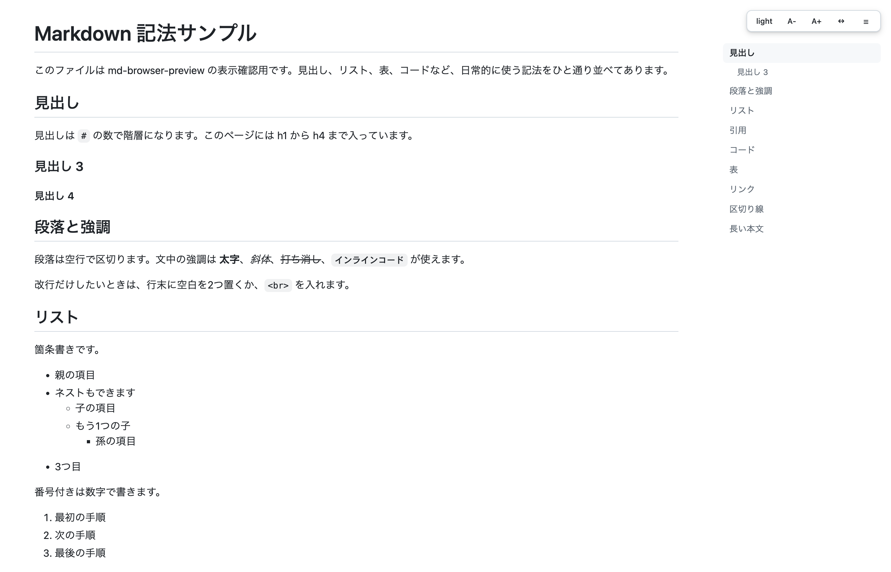
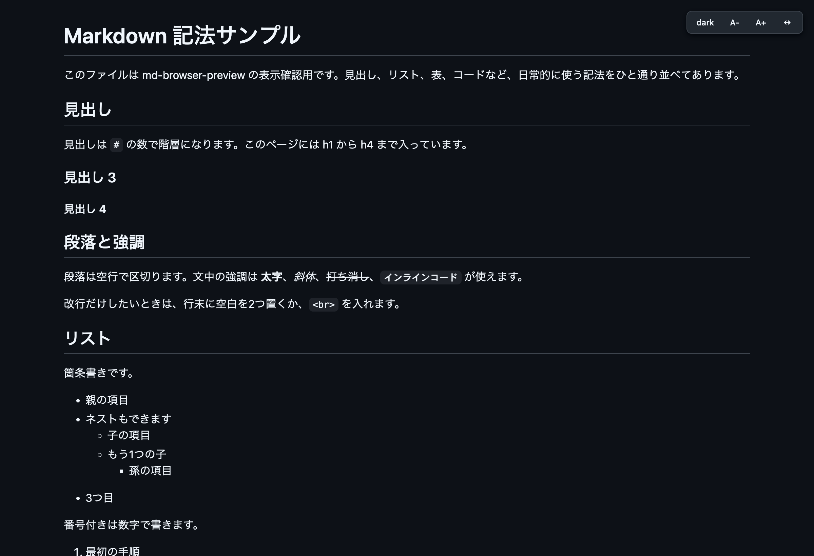

[English](README.md) | 日本語

# mdbrowse

編集中の Markdown を、自分の CSS でブラウザに表示する。エディタは何でもいい

`mdb` を1回実行するとタブが開き、以後はどのプロジェクトのどの Markdown を保存しても、そのタブに出る。設定は要らない。サーバーもポートも無い



## 何のために作ったか

エディタ内蔵のプレビューは、エディタの中で描画されるので見た目に手を入れられない。サーバーを立てるツールなら自由になるが、常駐とポートを引き受けることになる。これは pandoc の上に乗せたシェルスクリプトと、スタイルを収めた HTML が1枚あるだけで、固定パスに書き出してタブが自分で読み直す

出力先が常に同じなので、ファイルを切り替えてもタブは増えない。すでに開いているタブの中身が入れ替わる

## 必要なもの

- [pandoc](https://pandoc.org/) macOS は `brew install pandoc`、Debian/Ubuntu は `apt install pandoc`

## インストール

```sh
npm install -g @commte/mdbrowse
```

コマンドは `mdb` と `mdbrowse` の2つの名前で入る。以下の例は短いほうで書く

インストールせずに試す場合

```sh
npx @commte/mdbrowse file.md
```

スタイルシートはパッケージに同梱されている。自分で編集したい場合は `~/.config/mdbrowse/head.html` に取り出す。以後はそちらが同梱版より優先される

```sh
mdb --eject
```

<details>
<summary>ソースからインストールする場合</summary>

```sh
git clone https://github.com/commte/mdbrowse.git
cd mdbrowse
./install.sh
```

`mdb`（と長いほうの `mdbrowse`）が `~/.local/bin` に、スタイルシートが `~/.config/mdbrowse/head.html` に入る。再インストールしても自分で編集したスタイルシートは上書きされない。配布時の状態に戻したいときは `--force` を付ける

</details>

あとは1回実行する

```sh
mdb
```

プレビュー用のタブが開き、小さな背景プロセスが動きだす。以後どの Markdown を保存しても、どのプロジェクトのものでも、そのタブに出る。止めるときは `mdb --stop`、再開はまた `mdb`

## 使い方

```sh
mdb              # タブを開いて、以後ずっと追従させる
mdb --stop       # 背景の追従を止める
mdb --status     # いま何が出ているかを表示する
mdb file.md      # そのファイルを1回だけ変換する
mdb -w file.md   # 1つのファイルだけを前面で監視する（Ctrl-C で終了）
mdb --path       # 出力先の HTML のパスを表示する
```

### どうやって保存したファイルを見つけているか

Spotlight（`mdfind`）に「直近に保存された Markdown」を尋ねて、それを変換している。ディスクを歩き回らないので軽い。隠しディレクトリ、`node_modules`、`~/Library` の下は無視する。Spotlight が使えない環境では、`mdb` を実行したディレクトリを見る動きに落ちる

いま開いているファイルは毎秒そのまま見ているので、続けて保存したぶんはすぐ出る。別のファイルに移ったときだけ、Spotlight が気づくまで数秒かかる

最後に保存されたものを追うので、別のプログラムが Markdown を書くとプレビューが持っていかれる。1つのファイルに固定したいときは `mdb -w そのファイル.md` を使う。指定したものだけを見て、`Ctrl-C` で止まる

## ページ内の操作

右上に小さなバーが出る。テーマ、文字サイズ、本文幅、目次の表示を切り替えられる。選択はブラウザに保存されるので、再読み込みしても次に開くファイルにも引き継がれる。ディスクには何も書かず、サーバーも使わない

右サイドバーの目次は、そのファイルの見出しから組み立てられ、スクロール位置に追従する。見出しが3つ以上あるファイルで表示される



## エディタの設定

`mdb` が保存を追いかけるので、以下は要らない。背景で何も動かさず、キーを押して出したい場合はこちらを設定する。どれも1回だけ変換する `mdb <file>` を呼んでいる

### Zed

`install.sh` が `~/.config/zed/tasks.json` を作る。既存のファイルがある場合は上書きせず、貼り付ける内容を表示する。あとは `~/.config/zed/keymap.json` にキーを追加する

```json
{
  "bindings": {
    "cmd-shift-m": ["task::Spawn", { "task_name": "Preview in browser" }]
  }
}
```

つまずきやすい点

- 単独のキーの組み合わせにする。`cmd-k` から始まる2段のキーは、Zed 自身が前置きキーとして使っているため安定しない
- `"context"` を書くなら `Workspace` にする。`Editor` に書くと `task::Spawn` は発火しない

### VS Code / Cursor / Windsurf

`.vscode/tasks.json`

```json
{
  "version": "2.0.0",
  "tasks": [
    {
      "label": "Preview in browser",
      "type": "shell",
      "command": "mdb",
      "args": ["${file}"],
      "presentation": { "reveal": "never" },
      "problemMatcher": []
    }
  ]
}
```

`keybindings.json` で `workbench.action.tasks.runTask` に割り当てる

### Neovim

```lua
vim.keymap.set("n", "<leader>mp", function()
  vim.fn.jobstart({ "mdb", vim.fn.expand("%:p") })
end)

-- 保存のたびに更新する場合
vim.api.nvim_create_autocmd("BufWritePost", {
  pattern = "*.md",
  callback = function() vim.fn.jobstart({ "mdb", vim.fn.expand("%:p") }) end,
})
```

### JetBrains 系

設定 → ツール → 外部ツール で `mdb` を追加し、引数に `$FilePath$` を指定する。Keymap でショートカットを割り当てる

### Emacs

```elisp
(defun mdb ()
  (interactive)
  (start-process "mdb" nil "mdb" (buffer-file-name)))
```

### それ以外

`mdb /path/to/current/file.md` を実行できるエディタなら動く

## 見た目を変える

コードブロックの色付けは [Shiki](https://shiki.style/) を使う。既定のテーマは `github-dark` で、`MDBROWSE_SHIKI_THEME` に `tokyo-night` などを入れれば変えられる。色付けは変換時に済ませるのでページは静的なまま。Node が無い環境では pandoc 内蔵の色付けに切り替わる

それ以外の見た目に関わるものは `~/.config/mdbrowse/head.html` に集まっている。先頭の設定ブロック、それを使う CSS、バーと更新検知のスクリプトという構成で、配色とタイポグラフィは GitHub（Primer）に合わせてある。このファイルを直せば全ファイルのプレビューに反映される。バーで変更した値は、その人のブラウザ側で既定値を上書きする

表示確認用に `sample.md` が入っている

```sh
mdb sample.md
```

## 仕組み

```
ファイルを保存 → mdb（またはエディタのショートカット） → pandoc → /tmp/mdbrowse.html
                                                      → /tmp/mdbrowse-stamp.js
                                                              ↑
                                       ブラウザがスタンプを見て、変化したときだけ再読み込み
```

変換のたびに1行のスタンプファイルも書き出す。ブラウザは無条件に再読み込みせず、このスタンプを見て、新しく変換されたときだけ読み直す。画像のあるページで定期的にちらつかないのはこのため。スクロール中と印刷中、バーを操作している間はスタンプの確認を止める。画像の寸法はセッションに記憶して、読み込み中にレイアウトがずれないようにしている

YAML の frontmatter は本文に出さない。ファイル側の `title` が本文の先頭に見出しとして増えることはない

元ファイルからの相対パス（画像や隣のファイルへのリンク）は、変換時に絶対 `file://` へ書き換える。HTML が `/tmp` にあっても画像が表示されるのはこのため。書き換えるのは `img` や `a` などタグの属性だけなので、本文に `src="foo.png"` と書いても表示はそのまま。絶対パス、スキーム付きのもの（`http(s)`、`data:`、`mailto:` など）、`//` 始まり、ページ内アンカーには触らない。パスに `&` や `#`、空白が入っていても壊れない

監視は同じ変換を繰り返しているだけ。背景プロセスは、開いているファイルの更新時刻とサイズを1秒ごとに、直近に保存された Markdown を2秒ごとに見て、変わったら変換し直す。待ち受けるものは無くポートも持たない。`mdb --stop` で終わり、`ps` に見えるシェルのプロセスが1つあるだけ

ページは静的なので、待ち受けているものは何も無く、終了させる必要もない

## ライセンス

MIT
